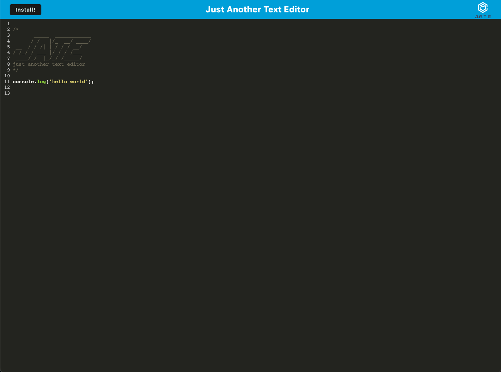

# JustAnotherTextEditor that needs a refactor

## Description
The goal of this refactor was to take an already existing application being the text editor know as JATE short for 'Just Another Text Editor' and reworking it so that the application is up to date with the most progressive web techniques. Turning an application into a PWA (Progressive Web Application) gives you a faster, more reliable and engaging version of your project. Plus PWAs can do some things that static webpages can't do like operate offline or be installable.

Ultimately in it's final version the application should meet all PWA requirements enhancing it's already working functionality.

## Installation
If you would like to use this application on your native device I would recommend first cloning the repository. Once thats done navigate into your root directory of the project and in your CLI type `npm run install` this command will install all the necessary dependencies on both the client side and server side for the application. You don't need to work about the scripts they are already setup properly and able to be used by the user. Once you have installed the necessary dependencies you can run `npm run start:dev` to spin up both the client side and server side of the application.

If you would like to install it straight from the browser you can just click the install button in the top left corner of the application.

## Usage
Link to the deployed application: ()

The application is pretty straightforward simply type into application whatever code snippets you would like to save as notes and the text editor will highlight the syntax.

If you would like to use the application offline you can do so by pressing the install button at the top left corner of the application.

## Credits

Starter code provided by the University of Arizona FullStack Web Development Bootcamp.

## License
MIT License

Copyright (c) [2023] [EvanTowlerton]

Permission is hereby granted, free of charge, to any person obtaining a copy
of this software and associated documentation files (the "Software"), to deal
in the Software without restriction, including without limitation the rights
to use, copy, modify, merge, publish, distribute, sublicense, and/or sell
copies of the Software, and to permit persons to whom the Software is
furnished to do so, subject to the following conditions:

The above copyright notice and this permission notice shall be included in all
copies or substantial portions of the Software.

THE SOFTWARE IS PROVIDED "AS IS", WITHOUT WARRANTY OF ANY KIND, EXPRESS OR
IMPLIED, INCLUDING BUT NOT LIMITED TO THE WARRANTIES OF MERCHANTABILITY,
FITNESS FOR A PARTICULAR PURPOSE AND NONINFRINGEMENT. IN NO EVENT SHALL THE
AUTHORS OR COPYRIGHT HOLDERS BE LIABLE FOR ANY CLAIM, DAMAGES OR OTHER
LIABILITY, WHETHER IN AN ACTION OF CONTRACT, TORT OR OTHERWISE, ARISING FROM,
OUT OF OR IN CONNECTION WITH THE SOFTWARE OR THE USE OR OTHER DEALINGS IN THE
SOFTWARE.

## Badges

## Features
The application features a number of data persistence techniques that utilize getting and storing data to an IndexedDB database.

The application is available to be downloaded and used offline.

The application has asset caching to keep track of user data.

## How to Contribute
It would be nice to have a button that a user can click called "save button" that stores
the users code to database and rerenders the page to a blank slate.

If the above functionality was to be added their would then also need to be a way for users
to access their saved coding notes.

## Tests
N/A at the moment